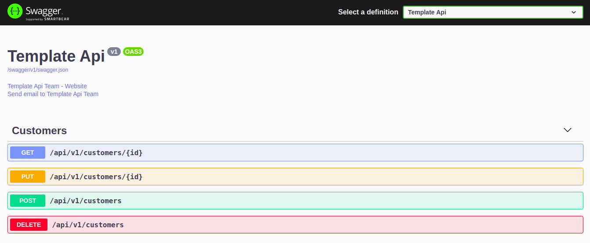

# Dewey Largo Api

> [`Dewey Largo`](https://simpsons.fandom.com/wiki/Dewey_Largo) é personagem do desenho animado [`Simpsons`](https://pt.wikipedia.org/wiki/Os_Simpsons), professor de música da orquestra sinfônica da escola de springfield.

Este projeto é responsável por gerenciar (orquestrar) o fluxo de vendas (transações financeiras) entre o Magalu e seus parceiros (autorizadoras).


- [Recursos](#recursos)
  - [Health Checks](#health-checks)
  - [Documentação APIs](#documentação-apis)
  - [Migrations](#migrations)
- [Desenvolvimento](#desenvolvimento)
  - [Requisitos](#requisitos)
  - [Instalação](#instalação)
    - [Docker](#docker-compose)
    - [NodeJs](#NodeJs)
    - [VS Code](#visual-studio-code)
  - [Configuração](#configuração)
  - [Instalando as dependencias](#Instalando-as-dependencias)
  - [Compilação e execução](#compilação-e-execução)
  - [Testes](#Testes)

## Recursos

### Health Checks

Endpoint `/api/health` para verificação de saúde da aplicação. Nesse endpoint é feita a validação se os recursos necessários para o bom funcionamento da aplicação estão disponíveis.

Quando sucesso, além do HTTP Status 200, o endpoint retorna uma lista com os recursos verificados, com seu status e o tempo gasto para cada verificação.

```json
{
  "status": "ok",
  "info": {
    "Orquestrador de módulos de integrações": {
      "status": "up"
    }
  },
  "details": {
    "Orquestrador de módulos de integrações": {
      "status": "up"
    }
  }
}
```

### Documentação APIs

Para a documentação é utilizado o [Swagger](https://swagger.io/). Ferramenta que provê interface para testes.



Por padrão a documentação está disponível no endpoint `/api/docs/#/`.

### Migrations

São utilizadas as evoluções de banco automáticas do [Typeorm](https://typeorm.io/#/).

Saiba mais sobre os [Migrations](https://github.com/typeorm/typeorm/blob/master/docs/migrations.md).

> As classes de configuração são inseridas automaticamente ao contexto do banco de dados

## Desenvolvimento

### Requisitos

```

* NodeJs
* Docker
* Docker Compose
* Mysql

```

### Instalação

#### Docker compose:

Acessar a pasta raiz do projeto e executar:

```

https://docs.docker.com/compose/install/
docker-compose up -d

```

#### NodeJs

```

[Documentação Oficial](https://nodejs.org/en/)

```

#### Visual Studio Code

```

https://code.visualstudio.com/docs/?dv=linux64_deb

https://github.com/OmniSharp/omnisharp-vscode

```

### Configuração

Lista de variáveis de ambiente necessárias para a execução da aplicação

| Variável               | Descrição                             |   Tipo   | Obrigatório |  Valor Padrão   |
| ---------------------- | ------------------------------------- | :------: | :---------: | :-------------: |
| DATABASE_NAME          | Nome do banco de dados                |  Texto   |     Não     | vd-server-api |
| DATABASE_USERNAME      | Usuário para conexão de dados         |  Texto   |     Não     | vd-server-api |
| DATABASE_PASSWORD      | Senha do usuário para acesso ao banco |  Texto   |     Não     | vd-server-api |
| DATABASE_HOST          | Host para acesso ao Banco             |  Texto   |     Não     |    localhost    |
| DATABASE_PORT          | Porta para acesso ao Banco            | Numérico |     Não     |      3306       |
| PORT                   | Porta da aplicação                    | Numérico |     Não     |      3000       |
| DATABASE_SYNCHRONIZE   | Sincronisa as informações do Banco    | Boolean  |     Não     |      true       |
| DATABASE_LOGGING       | Cria Log das informações do Banco     | Boolean  |     Não     |      true       |
| STACKDRIVE_ACTIVE      | Ativa/Desativa Log no stackdrive      | Boolean  |     Não     |      false      |
| GOOGLE_PROJECT_ID      | Id do projeto no stackdrive           |  Texto   |     Não     | vd-server-api |
| GOOGLE_CREDENTIAL_PATH | Credenciais do projeto no stackdrive  |  Texto   |     Não     | vd-server-api |
| LOGGER_LEVEL           | Nivel de Log                          |  Texto   |     Não     | vd-server-api |
| LOGGER_LABEL           | Ambiente para o Log                   |  Texto   |     Não     | vd-server-api |

### Instalando as dependencias

```bash
$ npm install
ou
$ yarn
```

### Compilação e execução

Após a [Configuração](#Instalando-as-dependencias) da aplicação executar os comandos abaixo na pasta raiz do projeto e executas os comandos abaixo.

```bash
# development
$ npm run start
ou
$ yarn start

# watch mode
$ npm run start:dev
ou
$ yarn start:dev

# production mode
$ npm run start:prod
ou
$ yarn start:prod

```

### Testes

```bash
# unit tests
$ npm run test
ou
$ yarn test

# e2e tests
$ npm run test:e2e
ou
$ yarn test:e2e

# test coverage
$ npm run test:cov
ou
$ yarn test:cov

```
